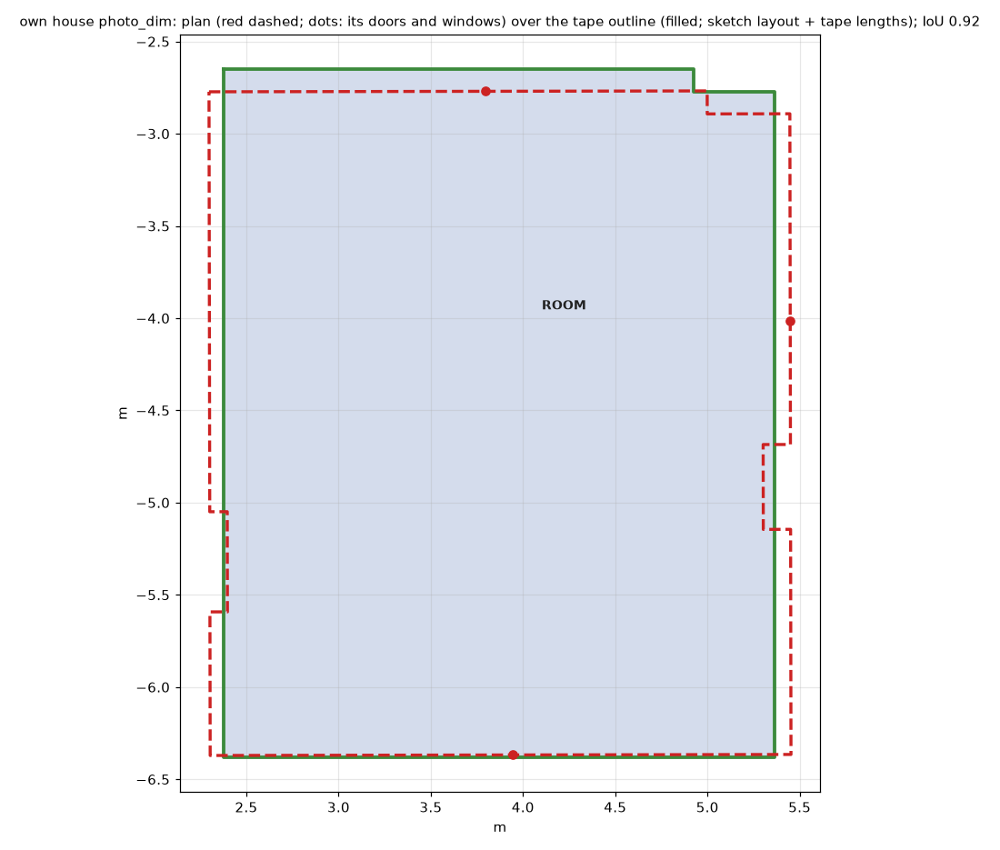
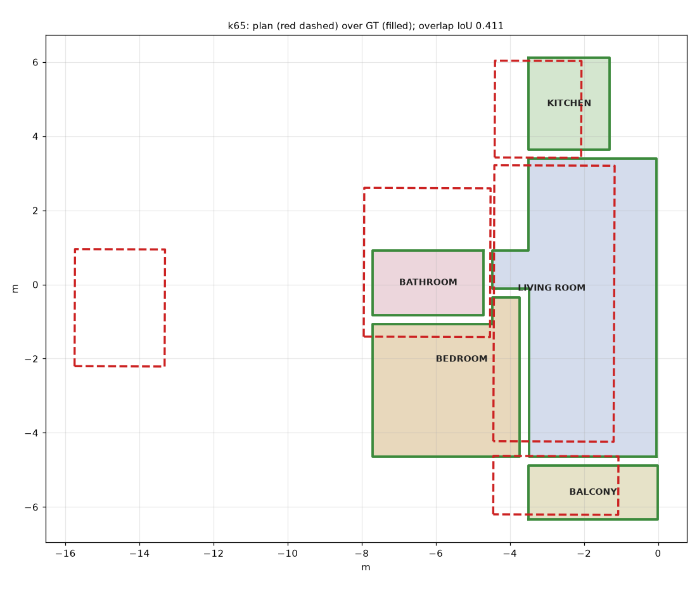
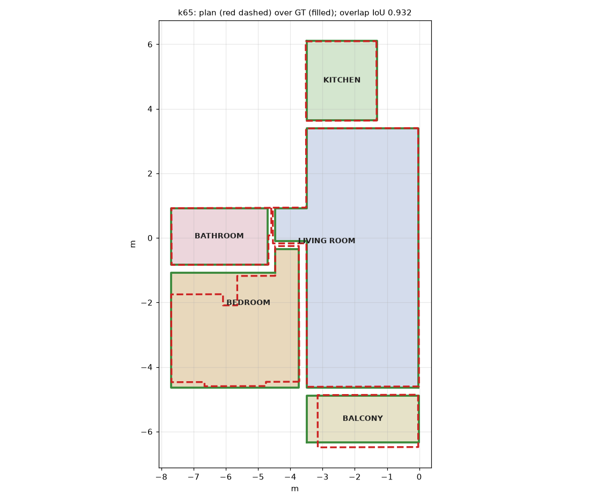
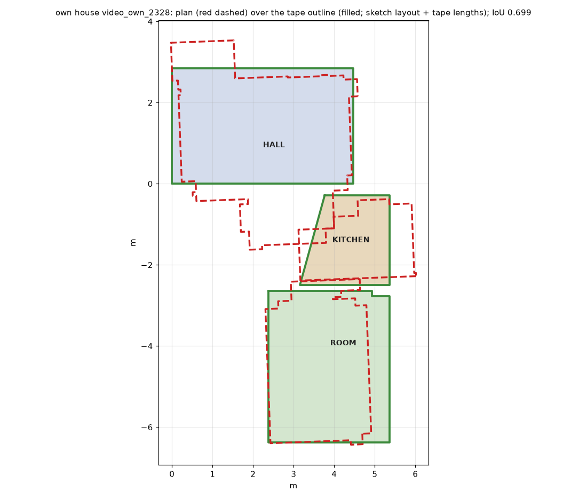
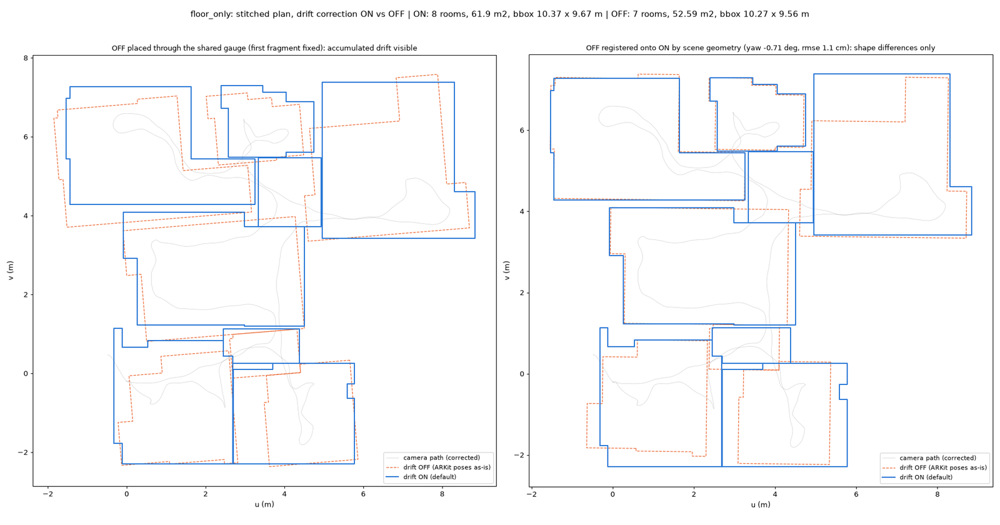
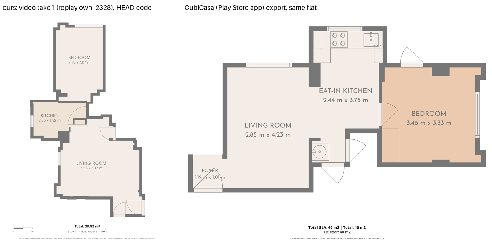

# Benchmark report (Deliverable 5)

Fresh runs of every benchmark capture with the final code, **`525a70a`** (5 Oct 2026), made between 16:00 and 16:38
IST and scored at 16:44 by `scripts/bench_results.py`. **Every number below comes from `results/summary.json`**; the
same numbers are tabulated in `results/tables.md`, and `results/README.md` lists the command that regenerates each
one. The run folder (logs, timing, the exact code as a git archive) is `outputs/benchmark/fresh_1600/`.

Verdicts are strict: a gate passes only when the brief's threshold is met. Missed walls and missed or phantom openings
count as failures.

## 1. What was measured, against what

| Capture | Tiers run | Ground truth | How the run was made |
|---|---|---|---|
| Own flat, bedroom, dim light (6 photos) | photo | tape (`data/own_house/gt/`), ceiling 2.6289 m | live |
| Own flat, same bedroom, lit (7 photos) | photo | tape | live |
| Own flat, `take1.mp4` walkthrough (bedroom, hall, kitchen) | video | tape: 14 walls, 4 doors, 3 windows | **replay** of the 9 cached DPVO/MoGe-2 runs; plan step and everything after it at HEAD |
| k65, simulated 5-room flat (31 photos, 1x lens) | photo (stitched), LiDAR | simulator geometry (`data/k65/gt/`) | live |
| k65 | video | simulator geometry | replan of the 4 Oct run (older front end): **indicative only** |
| Sample `single_room`, `floor_only`, `with_ceiling` | LiDAR; LiDAR `--no-drift` | none; the LiDAR plan is the reference for video | live |
| Same samples | video | the LiDAR plan of the same capture (reference, not truth) | replay of cached tracks |

The photo tier is judged on the own flat and on k65 only; the sample captures run the video and LiDAR tiers only
(D-071). No live take1 video run was added this time: the GPU queue reached it too late. The 9 caches are themselves
9 live runs of the same video (559–951 s each), so their spread is the tracker's run-to-run spread.

## 2. Gates

| Gate (brief) | LiDAR | Video | Photo |
|---|---|---|---|
| **Wall lengths** (photo ±8%, video ±3%; all walls) | k65: median error 1.8%, 4/26 within max(1 cm, 0.5%) — no separate LiDAR length gate; laser check cited in §8 | **FAIL**: own take1 0–3 of 14 per run (median error 14.8–31.0%); k65 0/26 | **FAIL**: own dim **5/6** (median 3.6%; the 12.6 cm step is missed), own lit 2/6 (8.9%), k65 11/26 (6.6%, 8 walls missed) |
| **Opening widths** ≤ 2 cm on ≥ 85% (detection scored) | **FAIL**: k65 5/9 found, 2 phantom, 4 within 2 cm (median 0.6 cm) | **FAIL**: 0 within 2 cm in every run (median 5.1–42.6 cm) | **FAIL**: own dim 3/3 found, widths 2.7–6.3 cm off; lit 2/3; k65 8/9 found, 3 phantom, median 8.2 cm |
| **Ceiling** ≤ 1.5 cm per room | **PASS** on k65: 5/5 rooms, errors +1.1 to +1.4 cm (all inside their intervals) | **FAIL**: 2.34–3.60 m (tape 2.63 m) | **FAIL**: own dim −7 cm, lit −11 cm; k65 −20 to +30 cm |
| **Ceiling spread** ≤ 1 cm across captures | not measurable: one LiDAR capture of k65; of the samples only `with_ceiling` sees ceilings | **FAIL** (above) | **FAIL**: dim vs lit 4.8 cm |
| **Repeatability** within max(1 cm, 0.5%) per wall | **FAIL**: repeat pair 15/87 walls (17.2%, Wilson 95% 10.7–26.5%); same-topology walls 14/30, median 1.8 cm. The same command twice gives the same plan (0.0 cm, all three samples) | **FAIL**: across 9 runs bedroom W6 0.91–3.31 m | **FAIL**: dim vs lit 0/6 walls (median 24.9 cm) |
| **Drift accountability**: method and on/off ablation | **PASS** (§5) | the video pose graph is the same solver on depth; no ablation | – |
| **Whole-property stitch**: adjacency, no overlaps, footprint ±8%, calibrated intervals | 1 plan per capture; k65 adjacency 4/4 with 1 extra pair, 0 overlaps, footprint −3.0% | **FAIL**: own take1 misses a room in 7 of 9 runs and overlaps two rooms in another; k65 adjacency 1/4, footprint +127% | **PARTIAL** on k65: the scored items pass (5/5 rooms, adjacency 4/4 with 0 wrong, 0 overlaps, footprint −3.8% inside its 95% interval, coverage 0.97), but the drawing puts one room about 9 m from its place and the bedroom about 2 m off (IoU 0.41) |
| **Calibration** (truth inside the 95% interval) | **FAIL**: k65 0.70 overall, walls 15/25 | **FAIL**: own 0.32–0.76 per run; k65 0.63 | **PASS**: own dim 1.00, lit 1.00, k65 0.97 (conservative) |

Summary: **LiDAR passes ceiling and drift and is deterministic, but misses the repeatability and opening gates. The
photo tier passes calibration and the scored stitch items on k65 (though one k65 room is drawn far from its place),
and comes within one wall of the ±8% wall gate on the dim own room. The video tier fails every accuracy gate.**

*Own bedroom from 6 dim photos (live) over the tape outline: 5 of 6 walls within 8%, footprint +0.6%, IoU 0.92.*

## 3. Accuracy against ground truth (detail)

| Capture, tier | Walls within tol | Median wall error | Truth inside 95% CI | Footprint | Ceiling | Openings found | Time |
|---|---|---|---|---|---|---|---|
| own dim, photo (live) | 5/6 (±8%) | 3.6% | 5/5 | 11.15 vs 11.09 m² (+0.6%) | 2.56 m (−7 cm) | 3/3, 0 phantom | 36 s |
| own lit, photo (live) | 2/6 (±8%) | 8.9% | 5/5 | 11.54 vs 11.09 m² (+4.0%) | 2.51 m (−11 cm) | 2/3, 0 phantom | 41 s |
| own take1, video (9 replays) | 0–3/14 (±3%) | 14.8–31.0% | 0.32–0.76 per run | 27.4–31.3 vs 28.0 m² (−2.3% to +11.9%) | 2.34–3.60 m | 0–4 of 4–6, 0–9 phantom | 43–72 s replan |
| k65, photo (live, stitched) | 11/26 (±8%) | 6.6% | 18/18 | 56.94 vs 59.20 m² (−3.8%), IoU 0.41 | −20 to +30 cm | 8/9, 3 phantom | 150 s |
| k65, LiDAR (live) | 4/26 (max(1 cm, 0.5%)) | 1.8% | 15/25 | 57.42 vs 59.20 m² (−3.0%), IoU 0.93 | +1.1 to +1.4 cm (5 rooms) | 5/9, 2 phantom | 440 s |
| k65, video (4 Oct replan) | 0/26 (±3%) | 20.9% | 10/16 | 134.35 vs 59.20 m² (+127%), IoU 0.30 | −68 to +146 cm | 3/9, 20 phantom | 333 s replan |

Sample captures, video against the LiDAR plan of the same capture (reference-based): room dimensions within ±3% —
single_room 0–2 of 4 (4 caches), floor_only 1 of 14 and 1 of 8, with_ceiling 0 of 6.

| | | |
|---|---|---|
|  |  |  |
| k65 photo, stitched at doors: adjacency 4/4, footprint −3.8%; one room drawn about 9 m off (left) | k65 LiDAR: IoU 0.93, ceilings +1.1 to +1.4 cm | own take1 video (cache own_2328): rooms overlap, walls 1/14 |

## 4. Repeatability

**Own bedroom, photo tier, the same room captured twice (dim vs lit)** (`summary.json`, own_house):

| Item | Dim | Lit | Tape | Dim − lit |
|---|---|---|---|---|
| W1 | 2.701 | 2.477 | 2.545 | +22.4 cm |
| W3 | 0.448 | 0.399 | 0.440 | +4.9 cm |
| W4 | 3.474 | 3.946 | 3.480 | −47.2 cm |
| W5 | 3.149 | 2.876 | 2.997 | +27.3 cm |
| W6 | 3.598 | 4.068 | 3.734 | −46.9 cm |
| Ceiling | 2.562 | 2.514 | 2.629 | +4.8 cm |
| Door D2 | 0.800 | 0.800 | 0.737 | 0.0 cm |
| Window | 1.532 | 1.530 | 1.473 | +0.2 cm |

Median |dim − lit| 24.9 cm (10.3%), max 47.2 cm; 1 of 6 walls within 8% of its pair. Openings repeat to 0.2 cm,
but both takes carry the same +6 cm bias on D2 and the window: the opening width is measured consistently, wrongly.
Most of it is the lit take's long side: 4.07 m against 3.73 m by tape (dim: 3.60 m).

**Own flat, video, 9 runs of `take1`:** wall W6 of the bedroom ranges 0.91–3.31 m, W1 1.02–2.18 m; the footprint
27.4–31.3 m². Openings measured inside one frame repeat well: the bedroom window 1.525 m ± 0.4 cm (tape 1.473), the
bathroom door 0.699 m ± 1.2 cm (tape 0.700). So the per-frame metric depth is repeatable and the camera path is not.

**LiDAR:** two scans of the same flat (with_ceiling vs floor_only), registered from the scene geometry: 15 of 87 walls
agree within max(1 cm, 0.5%) (17.2%, Wilson 10.7–26.5%), median |Δ| 6.4 cm, 34 walls without a partner. Where both
scans produced the same wall topology the median is 1.8 cm (14 of 30 pass). The error is which surface becomes a
wall, not the sensor. Re-running the same command gives an identical plan (max wall difference 0.0 cm on all three
samples).

## 5. Drift accountability (LiDAR)

Method: fragment pose graph with ARKit odometry, verified ICP loop closures and plane anchors, solved robustly in
4 DoF (`docs/modules/drift.md`, D-019). Ablation, same capture, drift correction on vs off (`--no-drift`):

| Capture | Footprint on / off | Rooms on / off | Walls the same within the gate | Median wall Δ |
|---|---|---|---|---|
| floor_only | 61.9 / 52.6 m² | 8 / 7 | 11 of 89 | 4.0 cm |
| with_ceiling | 62.5 / 61.9 m² | 8 / 9 | 8 of 92 | 7.5 cm |

Without correction floor_only loses a room and 15% of its area, and with_ceiling comes out with 9 rooms instead of 8. Figures:
`results/overlays/drift_on_off_floor_only.png`, `drift_on_off_with_ceiling.png`.

## 6. Head-to-head: ours vs CubiCasa vs tape (Part 3)

App: **CubiCasa 3.14.1** (Android, Google Play, checked 5 Oct 2026), one free scan of the own flat on 4 Oct 2026
16:34 GMT; its home data report and plans are in `data/cubicasa/`. **Deviation:** the brief asks for our LiDAR tier;
the phone (OnePlus Nord) has no LiDAR, so our camera tiers are compared with CubiCasa, itself a camera scan. Shared
dimensions are those CubiCasa reports (room width × length, area) that have a tape counterpart. CubiCasa's kitchen
length (3.75 m) takes in the passage and has none, so it is left out; CubiCasa reports no ceiling height.

| Dimension | Tape | CubiCasa | Ours, photo dim | Ours, photo lit | Ours, video (mean of 9 runs, range) |
|---|---|---|---|---|---|
| Bedroom long side (W6) | 3.734 | 3.46 (−27.4 cm) | **3.598 (−13.6)** | 4.068 (+33.4) | 2.572 (0.91–3.31) (−116.2) |
| Bedroom short side (W5) | 2.997 | 3.33 (+33.3 cm) | **3.149 (+15.2)** | **2.876 (−12.1)** | **2.829 (2.49–3.00) (−16.8)** |
| Bedroom area, m² | 11.09 | 11 (rounded) | **11.15** | 11.54 | – |
| Hall long side (W1) | 4.469 | 4.23 (−23.9 cm) | – | – | 3.470 (3.00–4.38) (−99.9) |
| Hall short side (W5) | 2.845 | 2.85 (+0.5 cm) | – | – | 2.558 (2.10–3.06) (−28.7) |
| Kitchen width (W2) | 2.210 | 2.44 (+23.0 cm) | – | – | 1.886 (1.21–2.85, 3 runs) (−32.4) |

Bold = ours beats or ties CubiCasa (|ours − tape| ≤ |CubiCasa − tape|). Beat-or-tie share (brief: ≥ 70%):
photo dim **3 of 3**, photo lit 1 of 3, both photo takes 4 of 6 (67%), video 1 of 5 (20%). **The photo tier beats
CubiCasa on the bedroom from the dim take, not from the lit take; the video tier loses to it.** CubiCasa's own errors
on these rooms are 0.5–33 cm.

## 7. Timing (pipeline runtime, one command per capture)

Upper bounds: the machine was shared and the CPU ran at about 100 °C (with_ceiling LiDAR took 472 s here against
238–374 s in earlier runs).

| Tier | Capture | Time |
|---|---|---|
| Photo | own bedroom, 6 / 7 photos | 36 / 41 s |
| Photo | k65, 31 photos, 5 rooms | 150 s |
| LiDAR | single_room / floor_only / with_ceiling | 77 / 234 / 472 s |
| LiDAR | k65 | 440 s |
| Video | take1 (117 s clip), live runs behind the caches | 559–951 s |
| Video | replan from a cache | 43–72 s |

## 8. Cited, not re-run

- **LiDAR against a laser** (ARKitScenes, 5 rooms with Faro scans, code of 4 Oct;
  `modules/benchmark_arkitscenes_accuracy.md`): room dimensions 8/8 within 1.5 cm, walls median 0.86 cm, ceilings 3/4
  within 1.5 cm.
- **Fix loop before/after** (`FIX_LOOP.md`, tags `before-fix` / `after-fix`, `fixloop.diff`): video walls within 3%
  0/0 → 3/0 of 14 (two runs per state).
- Two runs (k65 photo, floor_only LiDAR) lost their log files to a wrapper edit during the run; their plans are complete
  and their times come from `run_report.json` (`WRAPPER_FAULT.txt` in each folder).
