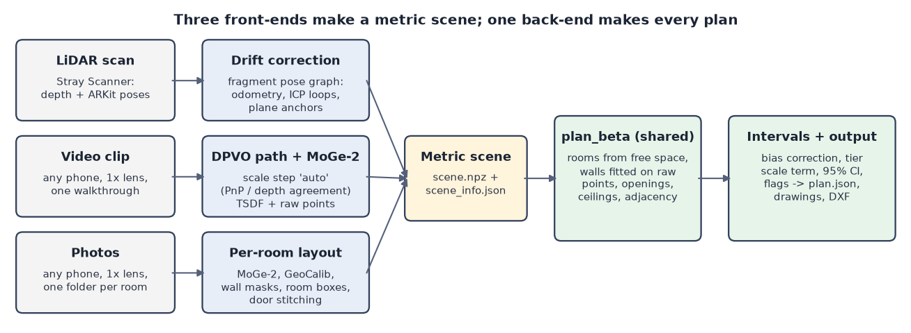
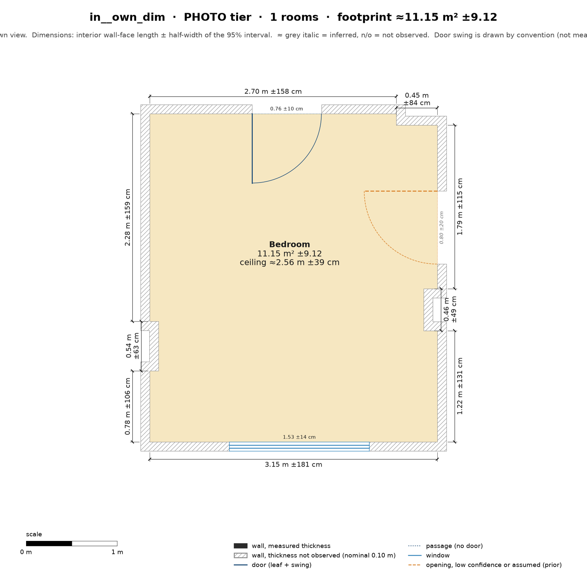
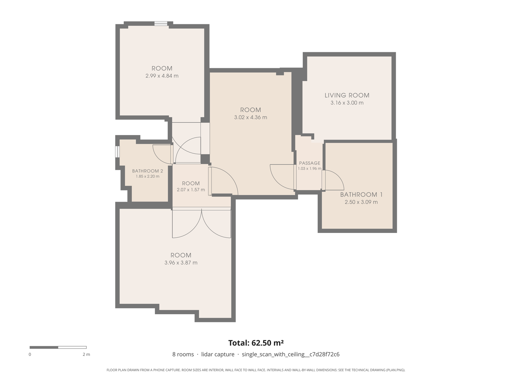

# Technical report: phone captures to dimensioned, stitched floor plans

Final code `0c97b0e`, 5 Oct 2026. The task: turn what a phone captures (a few photos per room, a walkthrough video, or
a LiDAR scan) into one stitched floor plan of the property, with every wall, opening and ceiling height measured to
the centimetre and an honest 95% interval on each number. This report explains each method we use, why it helps that
task, and what it measurably changes. Fresh numbers come from `results/summary.json` (the benchmark,
`BENCHMARK_REPORT.md`); method numbers cite their decision entry (D-xxx in `DECISIONS.md`). Paths are relative to
`docs/`.

## 1. Architecture

Three front-ends, one back-end (D-003). Each tier only has to produce a metric 3D scene; everything after the scene
is shared, so a fix to plan extraction helps every tier, and every tier returns the same `plan.json`.

*Figure 1. Architecture. Each tier only has to deliver a metric scene; the plan, the intervals and the drawings are
shared.*

One command runs any tier: `python scripts/run_capture.py <capture> --tier lidar|video|photo --out <dir>`.

## 2. Tiers and the device matrix

The tiers differ in where metric scale comes from, and so in how wide their intervals must be (`DEVICE_MATRIX.md`).

| Tier | Hardware | Metric source | Measured accuracy (fresh runs) |
|---|---|---|---|
| LiDAR | iPhone 12 Pro+ / iPad Pro 2020+ (Stray Scanner) | LiDAR depth, ARKit poses + our drift correction | k65: median wall error 1.8%, ceilings +1.1 to +1.4 cm, IoU 0.93; laser rooms 8/8 within 1.5 cm (cited) |
| Photo | any phone, 1x lens, 6–8 photos per room | MoGe-2 depth per photo, GeoCalib, EXIF focal | own bedroom (dim) 5/6 walls within 8%, footprint +0.6%; k65 stitched footprint −3.8% |
| Video | any phone, 1x lens | DPVO path, MoGe-2 depth, scale step "auto" | own flat: footprint −2.3% to +11.9%, walls 0–3 of 14 within 3% |

## 3. The methods, and what each one buys

### 3.1 Shared back end

| Method | What it is and how it works | Why it helps this task | What it changes |
|---|---|---|---|
| **Plan extractor v2** (`plan_beta`) | Space-first: free floor space becomes rooms (watershed), split along fitted wall lines; walls, openings, ceilings and adjacency are then measured per room | It never invents space: a room exists only where the camera saw floor | Chosen over a wall-first extractor that added 5–9 m² of rooms nobody entered (D-010, D-018); wall lines as cuts took matched rooms from 6 to 8/8 (`modules/plan_beta.md` v2.4) |
| **Raw-point wall fitting** | Each wall is a line fitted to the raw depth points behind it, weighted by 1/σ² of the sensor noise, not to a mesh or raster | Centimetre walls need the measurements themselves; a raster quantises them | Plane-fit error 0.04–0.08 mm: the fit is never the limit (`modules/arkitscenes_validation.md` §6) |
| **`remove_jogs` loop fix** | The step that snaps small jogs out of an outline stops when a snap returns the same corners (capped) | A plan must always finish; a stuck step gave no plan | Stitched k38 plan steps: over the 300 s limit → 2.7–2.9 s; the 16 plans that finished before are identical (D-088 follow-up, 0f277c4) |
| **95% intervals** | Every number carries fit ⊕ sensor ⊕ drift ⊕ tier scale term; video joins without verified geometry get a 20% σ floor and `reliability = low` (D-016, D-034) | The brief wants honest intervals; a camera tier must say it is less sure | Photo intervals hold the truth 1.00 / 1.00 / 0.97 of the time (own dim, own lit, k65); LiDAR 0.70 and video 0.32–0.76 do not (§5) |

### 3.2 LiDAR tier

**Pose-graph drift correction** (D-019, `modules/drift.md`). *What:* ARKit's poses drift (up to 5.95° of heading on
floor_only), so a wall seen twice comes out twice. *How:* the walk is cut into 1.5 m / 5 s fragments; a pose graph
joins them with ARKit odometry, ICP loop closures checked on fitness, RMSE and degeneracy, and plane anchors (each
fragment's wall direction and floor level); it is solved robustly (IRLS-Cauchy) in 4 DoF, because gravity is
observed. ICP runs single-threaded so the same input gives the same plan (D-029). *Why:* stitching a whole flat
from one walk is exactly where drift shows. *Change (ablation, fresh):*

| Capture | Footprint on / off | Rooms on / off | Cited: revisit surface gap on / off |
|---|---|---|---|
| floor_only | 61.9 / 52.6 m² | 8 / 7 | 2.27 / 14.29 cm |
| with_ceiling | 62.5 / 61.9 m² | 8 / 9 | 1.15 / 2.83 cm |

Without it floor_only loses a room and 15% of its area. The ceiling never enters the solve, so it is an
independent witness: its spread drops from 6.04 to 0.54 cm on with_ceiling (`modules/benchmark_lidar_sample.md` §3).

**Inward-bias correction** (D-021, D-027). *What:* Apple's LiDAR puts surfaces 0.68 cm into the room, so every
room measures about 1.4 cm short. *How:* each wall face moves out by the bias, corner-aware: at a reflex corner moving
out shortens a wall, so the shift follows the corner type. *Why:* at 1.5 cm gates a 1.4 cm systematic error is the
whole budget. *Change:* pre-registered on hold-out rooms, the mean error went from −1.25 to +0.11 cm; the
corner-aware version took laser walls within 1.5 cm from 82% to 94% (`modules/benchmark_arkitscenes_accuracy.md`
§4.3). Fresh k65 ceilings: +1.1 to +1.4 cm, all five inside 1.5 cm.

### 3.3 Photo tier

The photo tier measures each room from one spot (a turning series of stills) and joins rooms at doors. A bad photo
can only spoil its own room, which is why it works on the own flat where video does not (D-080).

| Method | How it works | Why it helps | What it changes |
|---|---|---|---|
| **Metric depth per photo** (MoGe-2) | A learned model gives metric depth and a point map from a single image | Scale without LiDAR and without a reference object (D-067) | Sizes inside one frame of the own video within −5.8% to +0.9% of tape (`FIX_LOOP.md`, rejected alternatives) |
| **Gravity** (GeoCalib) | Estimates each photo's up direction and field of view | Walls become vertical planes; tilt tells a ceiling photo from a turning one | Needed by every later step; no separate ablation |
| **Matching and pose graph** (ALIKED + LightGlue) | Learned features link photos of one spin and doorway pairs (taken within seconds, found from EXIF times) | Places photos without depth or poses from the phone | Doorway pairs 9/9 found, 0 false (`modules/photo_tier.md` v2.5) |
| **Per-room boxes from wall points** | Each room is fitted as a Manhattan box from its own spin's wall points | A spin is a small panorama: no match across rooms is needed | Base of every room; refined by the rules below |
| **Wall masks** (SegFormer-B5, ADE20K) | Only pixels the segmenter calls "wall" define a side | Furniture in front of a wall stops being the wall | k65 footprint −14.9% → −8.3%, k38 −8.0% → −3.8% (D-060) |
| **Focal from a sensor table** | EXIF 35 mm focal with the standard diagonal; for the OnePlus Nord, which writes none, the sensor's 8.0 mm diagonal (`photo/images.py`) | Wrong focal = wrong scale | Without a focal the scale was 22% off (D-022); the Nord writes no 35 mm focal, so the table supplies it (D-048) |
| **Ceiling-photo rule** (D-074) | The last photo of a series tilted up > 10° is the ceiling photo (18° elsewhere) | My phone's ceiling photos were 16.6° up and were taken as turning photos | Own lit: walls median 44.0% → 9.1%, ceiling 2.314 → 2.514 m |
| **Far-wall rule** (D-077) | A farther wall peak with ≥ 0.8 m of wall replaces a nearer surface (wardrobe, door leaf); sides only move out | Bedrooms have wardrobes against walls | Own area −17% → −4% (lit), −31% → −4% (dim); k65 unchanged |
| **Room shapes and alcoves** (D-082) | A step is cut where a doorway photo stands beyond a side, or wall is seen behind it | Rooms are not all rectangles | k38 living room IoU 0.901 → 0.917, area −5.9% → −2.9%; the k65 lobby is never seen (limit) |
| **Pillars and wall steps** (D-083), **pillar-face side** (D-086) | Per photo, a run of wall 0.15–0.8 m wide standing 0.06–0.6 m proud is a pillar or step; a box side resting on a pillar face moves back to the wall | Pillars are drawn; a side on a pillar face made the room short | D-086: own lit 0 → 2 of 6 walls within 8%, own dim 4 → 5 (W3 30.0% → 1.8%); k65 and k38 unchanged |
| **Door-anchored stitching** (D-081, D-088) | The photo that looks out through a door matches the neighbour room; the two rooms snap together at that door | Turns separate rooms into one property plan with correct neighbours | k65 IoU 0.376 → 0.411, footprint −5.0% → −3.8%; fresh k65: adjacency 4/4, no overlaps, one room still drawn about 9 m off |

*Figure 2. k65 from 31 photos (live), plan dashed over the truth: 5/5 rooms, adjacency 4/4, footprint −3.8%. One room
is drawn about 9 m from its place (left) and the bedroom about 2 m off (IoU 0.41): the room graph is right, the
drawing is not.*

### 3.4 Openings

| Method | How it works | Why it helps | What it changes |
|---|---|---|---|
| **Doors and windows from the segmenter** | Door and window pixels, cast onto the measured wall, give the opening's ends | Openings need widths, not just positions | Widths repeat within 0.2 cm between two own takes, with a +6 cm bias (`BENCHMARK_REPORT.md` §4) |
| **Scoring by position** (D-085) | Predicted openings pair with true ones on the same wall, nearest centre (one Hungarian match) | Pairing by width matched the wrong doors and hid errors | Two k65 "errors" of +18.0 and +35.2 cm were mismatches |
| **Door priors** (rule d, D-085) | Where a doorway is crossed but no leaf is seen, a door of standard width is placed and flagged as a prior | A walk-through stands in doorways and never sees the leaf | Crossed doorways get a door; its width is a flagged prior, not a measurement |
| **See-through doorways** | A span where depth runs past a measured wall, with both jambs in one photo, is an open doorway | Open doors are seen as holes, not as door leaves | Own bedroom door D1 found from the dim photos: 0.760 m vs 0.787 m tape; lit misses it (no photo sees it whole) |

### 3.5 Video tier

| Method | How it works | Why it helps | What it changes |
|---|---|---|---|
| **DPVO poses + MoGe-2 depth** | DPVO tracks the camera path up to scale; MoGe-2 gives metric depth per keyframe | No LiDAR, no poses from the phone | Window repeats to 0.4 cm SD over 9 runs; the path is the weak part |
| **Scale from depth agreement** | Keyframe pairs vote on DPVO's scale where its depth and MoGe-2's agree | Turns DPVO's path into metres | On take1 only 25–31 of 902 pairs vote, so a 13× scale drop went unseen (`FIX_LOOP.md`) |
| **PnP scale votes** (D-075) | PnP on MoGe-2 depth between nearby keyframes gives the metric step | Many more votes, so the scale follows DPVO's drift | Same DPVO run: kf1–kf42 10.47 → 0.68 m (0.50 m true), footprint 37.8 → 29.2 m²; worse on blurred sample videos (D-076) |
| **Scale step "auto"** (D-087) | Per segment: PnP where its votes cover ≥ 50% of keyframes, depth agreement elsewhere | Keeps each method where it works | 8 take1 caches: footprint error 0.4–66.8% → 0.6–8.7%; walls within 3% unchanged (0–3 of 14) |
| **TSDF fusion** | Scaled depth maps fused along the path into a TSDF plus a raw-point surface with a 5 cm noise σ | Same scene format as LiDAR, so the shared back end runs | 1 room → 3 rooms on single_room (plan_beta v4) |
| **SfM path gate** (tried, kept off) | A global SfM path (pycolmap) used when one model holds ≥ 80% of the walk | Walk order would not matter | Replays: 2 of 3 rules fail, samples unchanged → an option only (D-087) |
| **Room split by camera stays** (tried, kept off) | Rooms split between places the camera stayed ≥ 4 s | Hall, passage and kitchen are one basin in video | Mixed: one cache 1 → 4 walls within 10%, another footprint error 34.5% → 43.9% (D-079) |

*Figure 3. Own flat, video (cache own_2328): all three rooms, but overlapping; 1 of 14 walls within 3%.*

### 3.6 Tried and dropped

| What | Why dropped |
|---|---|
| Wall-first plan extractor (alpha) | Invented 5–9 m² of rooms; four of its parts were ported (D-010, D-018) |
| Learned polygon models (RoomFormer, Raster2Seq) | Decimetre accuracy, research licences (D-004) |
| 6-DoF pose graph | Tilted fragments by about 1° (`modules/drift.md`) |
| Multi-phase extractor vote | Predicted about 17/87 walls in gate, measured 11/94 (D-030) |
| Reference object (A4 sheet) | Made video scale worse (−18.7% vs −1.7%); opt-in only (D-067) |
| Door-height scale cue | Built and measured, kept off (D-069) |
| 0.5x ultra-wide photos | Reverted to 1x (D-065, D-068) |
| Video frames as photos | One frame measures well, but the frames still hang on one broken path (D-080) |
| cuDNN deterministic flag for DPVO | DPVO still varies from frame 1 (I-007) |

## 4. Error budget (LiDAR, one interior distance, 95%)

| Term | Size | In the interval? |
|---|---|---|
| Sensor noise per point | σ 6–7 mm below 2 m, 16–19 mm at 2.5–4 m (D-011) | yes: fit weights and a sensor term |
| Plane-fit error | 0.04–0.08 mm | yes, negligible |
| Surface bias, 0.68 cm into the room | −1.37 cm per distance before correction | corrected (D-021, D-027); residual ±1.6 cm, ±2.1 cm across devices |
| Residual drift | 2.0 cm between passes, 1.0 cm within one | yes (`modules/drift.md` §5.5) |
| Topology: which surface became the wall | tens of cm when it happens | **no**: handled by flags and status, not σ |

Camera tiers add a scale term σ_s·L (2σ_s·A for areas) and a 5 cm surface σ; photo box sides add half their distance.

## 5. Calibration: do the 95% intervals hold the truth 95% of the time?

| Tier, capture | Coverage | Read |
|---|---|---|
| Photo, own dim / lit | 1.00 / 1.00 (5/5 walls each) | honest, a little wide |
| Photo, k65 stitched | 0.97 (walls 18/18) | honest |
| LiDAR, k65 | 0.70 (walls 15/25) | too narrow: the misses are topology, not noise |
| LiDAR vs laser (cited) | 0.93 (n 27) | close to nominal |
| Video, own take1 | 0.32–0.76 per run | too narrow: the path breaks, which no σ covers |

Where the error is measurement, intervals are calibrated. Where it is topology (a missing room, a wall taken from the
wrong surface) no σ covers it; the plan flags it instead (`inferred` walls, `coverage_warning`,
`whole_scene_consistent`, `reliability`).

## 6. The fix loop (`FIX_LOOP.md`)

- **Declared gate:** video walls within ±3% on the own walkthrough: **0 of 14** in both runs (worst under a ranking
  rule committed beforehand).
- **Root cause:** the scale step could not follow DPVO's scale. DPVO's scale dropped about 13× at t = 34.5 s, where
  the phone turned past a blank pillar; only 25–31 of 902 keyframe pairs voted, and in an earlier run of the same
  video none voted between t = 12 and 37 s.
- **Fix:** scale votes from PnP on MoGe-2 depth (D-075). **Prediction:** 0 of 14 (range 0–2), gate still fails.
- **What happened:** 3 and 0 of 14; but the old and new scale step on the same DPVO runs gave 1/1 and 1/0, so the
  gate did not move beyond run-to-run noise, and the plans (2 and 1 rooms against 3) missed the prediction.
- **Post-mortem:** the prediction came from replays of one single-segment run; the self-check limit, set for the old
  clamp, then dropped most of the walk (20 of 121 keyframes kept on one run). The fix did hold the walk together (kf1–kf42 10.47 → 0.68 m), which led to
  D-076 and the per-segment "auto" step (D-087).
- **Regenerate:** tags `before-fix` and `after-fix`; `git diff before-fix after-fix -- floorplan/ tests/`
  (`fixloop.diff`).

## 7. Known failure modes (`FAILURE_MODES.md`)

| Condition | What happens | What the pipeline does |
|---|---|---|
| Mirror | depth sees a reflected room; a mirror can look like a doorway | confidence filter; space not enclosed by measured walls dropped; a see-through doorway needs both jambs |
| Glass | no LiDAR returns, rooms merge | glazing found by the sill test; marked `not_observed`, never free space |
| Wet-look floor | phantom points below the floor (≤ 0.7%) | robust floor peak; points excluded |
| Low light | LiDAR unaffected; camera tiers lose matches | dim own photos still gave 5/6 walls; video loses track earlier |
| Furniture against walls | wardrobe fronts taken as walls | wall masks, far-wall rule (D-077) |
| Blank walls in video | DPVO restarts or changes scale | segments, self-check, `reliability = low`, σ floor |
| Room never entered | no room | `coverage_warning` |
| Non-Manhattan wall | squared off | not handled |

| | |
|---|---|
|  |  |
| *Figure 4. Own bedroom, 6 dim photos: 5/6 walls within 8%, footprint +0.6%* | *Figure 5. Ours vs CubiCasa 3.14.1; dimension table in `BENCHMARK_REPORT.md` §6* |
|  |  |
| *Figure 6. Dim take, technical drawing: door D1 found as a see-through doorway (0.760 m vs 0.787 m tape)* | *Figure 7. LiDAR, with_ceiling sample: 8 rooms, one plan, same plan on every rerun* |

Deviations from the brief (no LiDAR phone, so the head-to-head uses the camera tiers; no staged damage) and all
licences are in `COMPLIANCE.md` and `DISCLOSURES.md`.
